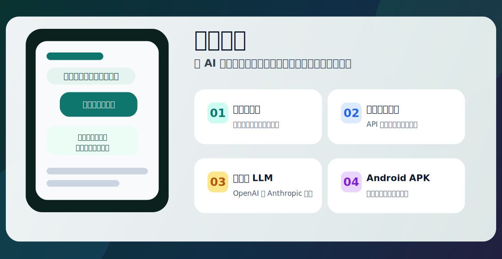
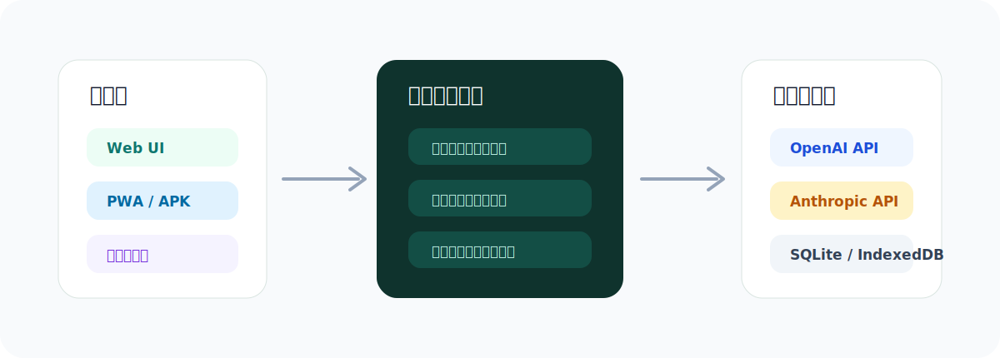
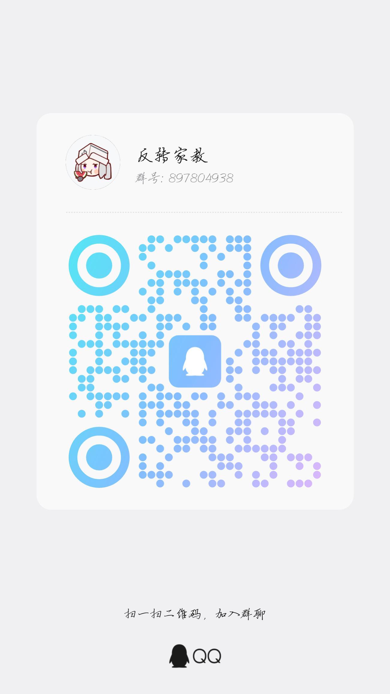

<p align="center">
  
</p>

<h1 align="center">Reverse Tutor</h1>

<p align="center">
  把 AI 从“答案机器”变成会追问、会引用上下文、会实时回复的学生。
</p>

<p align="center">
  <a href="https://github.com/zhuxice-ctrl/Reverse-Tutor/releases/latest">
    
  </a>
  
  
  
  
</p>

<p align="center">
  <a href="https://dl.zeroxcore.tech/reverse-tutor/Reverse-Tutor-v0.17.11.apk"><strong>下载 Android APK</strong></a>
  ·
  <a href="https://github.com/zhuxice-ctrl/Reverse-Tutor/releases/latest">查看最新版本</a>
  ·
  <a href="#快速开始">本地运行</a>
  ·
  <a href="#移动端打包">自己打包</a>
</p>

<p align="center">
  
</p>

## 这是什么

Reverse Tutor 是一个“反向教学”和“目标推动”工具。你不再只是向 AI 提问，而是让 AI 扮演学生、追问者、检查者或协作者。你需要把目标、知识或方案讲清楚，AI 会继续追问、复盘、记录锚点，并在后续对话里推动你把事情做完。

它最初适合学习场景：用“教别人”的方式逼自己真正理解。现在也支持更宽泛的目标型使用，例如项目推进、方案打磨、习惯监督、面试训练、产品讨论和个人任务复盘。移动端走本地优先路线：会话、资料、API 配置保存在设备侧，APK 里还带后台回复服务。

## 核心能力

| 能力 | 说明 |
|---|---|
| 反向教学对话 | AI 扮演你设定的人格，用追问和反馈逼近清晰表达，而不是直接替你完成。 |
| 目标锚点 | 记录目标、要求、知识点和新增约束，减少长对话中的跑偏。 |
| 资料知识库 | 支持 PDF、DOCX、TXT、Markdown、HTML、PPTX、EPUB 等资料导入，并进入检索和洞察图谱。 |
| 洞察图谱 | 汇总掌握度、资料节点、随笔节点、重点和下一步动作，便于从聊天跳回结构化线索。 |
| 引用回复 | 长按消息可引用 AI 或自己的发言，让后续回复明确基于哪一句上下文。 |
| 随笔、回档、删除 | 长按气泡可写随笔、从某条消息回档重生成，或永久删除单条消息及关联记忆。 |
| 主动对话 | 在线模式下可按间隔主动发起提醒，离线模式保持静默，睡眠模式降低频率。 |
| 多模型接入 | 移动端支持 OpenAI Chat API 与 Anthropic Messages API 两类协议，内置 DeepSeek、MiniMax、OpenAI、Qwen、Kimi、Groq、OpenRouter、Ollama、LM Studio 等预设。 |
| 本地长期配置 | 移动端会把 LLM 配置和会话数据保存在设备侧，绑定 API 后可长期使用。 |
| Android 后台回复 | APK 内置后台服务，退出界面后仍可继续处理已提交的回复任务，完成后通过系统通知提醒。 |
| 应用内更新 | 内置自建高速下载源和 GitHub 备用源，支持应用内检查新版 APK。 |

## v0.17.11 更新重点

- 配置档案改为可折叠管理区，默认收起，减少设置页占用空间。
- 配置档案会显示已保存数量和当前档案，展开后可保存、删除、一键切换多套模型配置。
- 最多保留 16 套常用 LLM 配置，适合多模型用户长期切换使用。

## v0.17.10 更新重点

- 新增 GLM / Anthropic 预设，支持智谱 Claude API 兼容入口 `https://open.bigmodel.cn/api/anthropic`。
- Anthropic 协议支持完整 `/v1/messages` endpoint，避免手动填写完整地址后重复拼接。
- Base URL 会自动识别 OpenAI 格式或 Claude / Anthropic 格式，连接失败时弹出配置诊断。

## v0.17.9 更新重点

- 新增 LLM 配置档案，可保存多套服务商、接口类型、模型能力、Base URL、Model 和 API Key。
- 配置页支持一键切换常用模型档案，适合 GLM、Kimi、DeepSeek、Qwen、MiniMax 等多模型轮换使用。
- 配置档案只保存在本设备，并继续兼容体验额度与本地 API 优先逻辑。

## v0.17.8 更新重点

- 新增 GLM / 智谱官方预设，并补齐 Kimi CN / Global、Qwen、DeepSeek、MiniMax 的国产 OpenAI 兼容适配。
- 修复 GLM 官方接口返回 `messages 参数非法` 的问题：请求会合并 system 消息，并在开场时补齐 user 消息。
- 国产兼容模型默认不再强制发送 `response_format`，并支持完整 `/chat/completions` endpoint 输入。

## v0.17.7 更新重点

- 修复体验额度模式下发送消息失败的问题：当服务端中转不支持流式输出时，前端会正确降级到非流式回复。
- 修复 `streamObj.fullText is not a function` 导致的红色失败气泡，重发后不会再卡在同一错误。
- 公开更新说明不展示具体体验额度，只保留“受控体验额度”的说明。

## v0.17.6 更新重点

- 新增“体验额度”模式：用户可在设置页输入兑换码，兑换后无需填写自己的模型 API Key。
- 体验请求通过服务器 `/api/trial` 中转，真实模型 Key 只保存在服务端，不写入 APK。
- 兑换码默认绑定单设备，使用受控体验额度；服务端会记录用量并在请求前做额度预检。
- 新增体验码生成脚本和服务器部署说明，便于后续批量发放、排查消耗和控制风险。

## v0.17.5 更新重点

- 新增 MiniMax 预设：支持 MiniMax OpenAI-compatible 与官方推荐的 Anthropic-compatible 两种入口，默认模型为 `MiniMax-M2.7`。
- 修复 MiniMax OpenAI 接口 payload：自动使用 `max_completion_tokens`，并把温度限制在 MiniMax 要求的 `(0, 1]` 范围内。
- 优化 MiniMax 流式输出解析，兼容累计式 delta，减少逐字输出重复或异常的问题。
- Android 后台 LLM 服务同步支持 MiniMax 协议差异，退到桌面后生成也能使用同一套配置。

## v0.17.1 更新重点

- 连续发送优化：AI 生成中继续发送的新消息会立刻进入对话并写入本地库，显示“待处理/处理中”，上一轮完成后再合并为下一轮上下文输出。
- 输出链更接近 ReAct：先观察连续用户输入，再在当前 turn 完成后统一决策回复，避免重复插入用户消息，并减少重复上下文消耗。
- Android 桌面显示名回归中文“反转家教”；仓库名、Release 标题、包名和 APK 文件名仍保持 Reverse Tutor / `Reverse-Tutor-v{versionName}.apk`。

## v0.17.0 更新重点

- 品牌统一为 **Reverse Tutor**，APK 命名为 `Reverse-Tutor-v0.17.0.apk`，不再使用 `test` 或 `debug` 后缀；Android 包名仍保留 `com.reversetutor.app`，便于覆盖升级。
- 新增流式输出：OpenAI SSE 与 Anthropic delta 双协议逐字生成，不支持流式的 provider 自动降级。
- Eval 评估与 Reply 回复解耦，JSON 评估不再阻塞实时回复显示。
- 聊天 UI 支持实时气泡逐字渲染和 `● 生成中` 指示器，回复不再等整段完成才出现。
- 新增多消息队列：AI 生成中仍可继续发送，消息会按顺序排队处理。
- 新增 AI 多气泡：LLM 可用 `|||` 分隔输出多条连续消息气泡，更接近真实聊天软件。
- 延续 v0.16.1 的 Android 体验修复：后台 LLM 生成、原生通知、中文输入法光标修复、长按引用/随笔/回档/删除菜单、图标与启动页统一。
- 补强文档导入：PDF、DOCX、TXT、Markdown、HTML、PPTX、EPUB 多选导入，图文混排 PDF 在不支持视觉时也会先读取可提取文字。

## 产品结构

<p align="center">
  
</p>

```text
.
├── server.py                 # FastAPI 服务入口
├── engine.py                 # Reverse Tutor 核心对话引擎
├── llm.py                    # 服务端 LLM / mock 适配层
├── db.py                     # SQLite 数据模型与操作
├── adapters/                 # 飞书 / QQ / Hermes 等平台适配
├── static/index.html         # 桌面 Web UI
├── static/app/               # 移动端 PWA 源码
├── mobile/                   # Capacitor Android APK 工程
└── tests/                    # pytest 测试
```

## 快速开始

环境要求：

- Python 3.10+
- Node.js 18+，仅在打包移动端时需要
- Android Studio / Android SDK，仅在打包 APK 时需要

安装依赖并启动服务：

```powershell
pip install -r requirements.txt
copy .env.example .env
python -m uvicorn server:app --reload --host 127.0.0.1 --port 8000
```

启动后在浏览器打开即可。不配置 LLM 也能运行，项目会自动使用 mock 模式。

## LLM 配置

服务端 `.env` 使用 OpenAI 兼容协议：

```env
LLM_BASE_URL=https://api.deepseek.com/v1
LLM_API_KEY=sk-your-key-here
LLM_MODEL=deepseek-v4-flash
```

移动端可以直接在应用内配置模型。当前移动端把“接口类型”明确分成两类：

| 接口类型 | 典型 URL | 适用模型 |
|---|---|---|
| OpenAI | `https://api.deepseek.com` / `https://api.minimax.io/v1` | DeepSeek、MiniMax、OpenAI、Qwen、Kimi、Groq、OpenRouter、Ollama、LM Studio |
| Anthropic | `https://api.deepseek.com/anthropic` / `https://api.minimax.io/anthropic` | 支持 Anthropic Messages API 的模型或兼容代理 |

如果模型不支持图片，发送图片或表情时不会让 DeepSeek 这类文本模型强行识图；多模态能力由你选择的模型预设决定。

### 体验兑换码

移动端也支持“体验额度”模式：用户输入兑换码后，App 会换取短期 `trial_token`，后续请求走你的服务器 `/api/trial/chat/completions` 中转，不会把真实模型 API Key 下发到 APK。

渠道切换规则：`体验额度` 是独立 provider，只有该 provider 会保存并调用 `/api/trial`；切换到 DeepSeek、MiniMax、OpenAI 或手动填写后，App 会清除残留的 trial 调用地址，不会继续使用兑换码中转。正常服务商配置会额外保存为“本地 API 快照”，发送前优先使用这个本地 API；兑换码成功后只作为备用体验渠道保存，不会覆盖用户自己的 API 配置。只有同一服务商的 OpenAI / Anthropic 协议切换会保留已保存 Key，跨服务商切换需要重新填写 API Key，避免把兑换码 token 或其他服务商 Key 混用。

服务端环境变量：
```env
TRIAL_LLM_BASE_URL=https://api.deepseek.com
TRIAL_LLM_API_KEY=sk-your-server-side-key
TRIAL_LLM_MODEL=deepseek-v4-flash
TRIAL_MAX_OUTPUT_TOKENS=700
```

生成兑换码：
```powershell
py -3 scripts/generate_trial_codes.py --count 20 --prefix RT --total-yuan <每码总额度>
```

默认每个兑换码绑定一台设备、不限制单日使用；如需临时加日限，可额外传 `--daily-yuan`。计费单价可通过 `TRIAL_PROMPT_PRICE_MICRO_CNY_PER_MILLION` 和 `TRIAL_COMPLETION_PRICE_MICRO_CNY_PER_MILLION` 调整。

## 移动端打包

```powershell
cd mobile
npm install
npm run build:apk
```

产物位置：

```text
mobile/android/app/build/outputs/apk/release/app-release.apk
```

当前公开版本：

- 自建高速源：https://dl.zeroxcore.tech/reverse-tutor/Reverse-Tutor-v0.17.11.apk
- GitHub Release：https://github.com/zhuxice-ctrl/Reverse-Tutor/releases/latest

## 应用更新

移动端默认使用自建更新源：

```text
https://dl.zeroxcore.tech/reverse-tutor/latest.json
```

更新规则：

- 优先比较 `versionCode`，新版必须大于当前 APK 的 `versionCode`。
- 如果没有 `versionCode`，再比较 `versionName`。
- 下载源优先使用自建源，失败后再尝试 GitHub Release 备用源。
- Android 侧不能静默安装 APK，下载完成后会打开系统安装器，由用户确认安装。

`latest.json` 示例：

```json
{
  "versionCode": 32,
  "versionName": "0.17.11",
  "apkUrl": "https://dl.zeroxcore.tech/reverse-tutor/Reverse-Tutor-v0.17.11.apk",
  "apkMirrors": [
    "https://github.com/zhuxice-ctrl/Reverse-Tutor/releases/download/v0.17.11/Reverse-Tutor-v0.17.11.apk"
  ],
  "publishedAt": "2026-05-22",
  "releaseNotes": [
    "新增 LLM 配置档案",
    "支持一键切换常用模型配置"
  ]
}
```

## 开发与测试

```powershell
pytest -q
```

移动端改动建议至少跑：

```powershell
pytest -q tests/test_mobile_persistence.py tests/test_android_background_llm.py tests/test_update_check_resilience.py
cd mobile
npm run build:apk
```

## API 简表

| 方法 | 路径 | 说明 |
|---|---|---|
| GET | `/api/health` | 健康检查 |
| POST | `/api/trial/redeem` | 兑换体验码并绑定设备 |
| GET | `/api/trial/status` | 查看体验额度剩余 |
| POST | `/api/trial/chat/completions` | OpenAI-compatible 体验 LLM 中转 |
| POST | `/api/sessions` | 创建会话 |
| GET | `/api/sessions` | 列出会话 |
| GET | `/api/sessions/{id}` | 获取会话详情 |
| DELETE | `/api/sessions/{id}` | 删除会话 |
| POST | `/api/sessions/{id}/chat` | 发送一轮对话 |
| POST | `/api/sessions/{id}/opening` | 触发开场 |
| GET / POST | `/api/sessions/{id}/anchors` | 查看或添加锚点 |
| GET | `/api/sessions/{id}/export` | 导出会话 |
| POST | `/api/adapters/{platform}/webhook` | 平台 webhook |
| GET | `/api/bindings` | 查看平台绑定 |

## 当前状态

项目仍在快速迭代中。当前 APK 已使用 release 签名，支持覆盖安装升级。后续正式分发还需补充权限说明、隐私政策和更完整的设备兼容测试。

## 加入交流群

欢迎入qq群反馈给我更新动力。

<p align="center">
  
</p>

<p align="center">
  QQ 群：<strong>897804938</strong>
</p>
